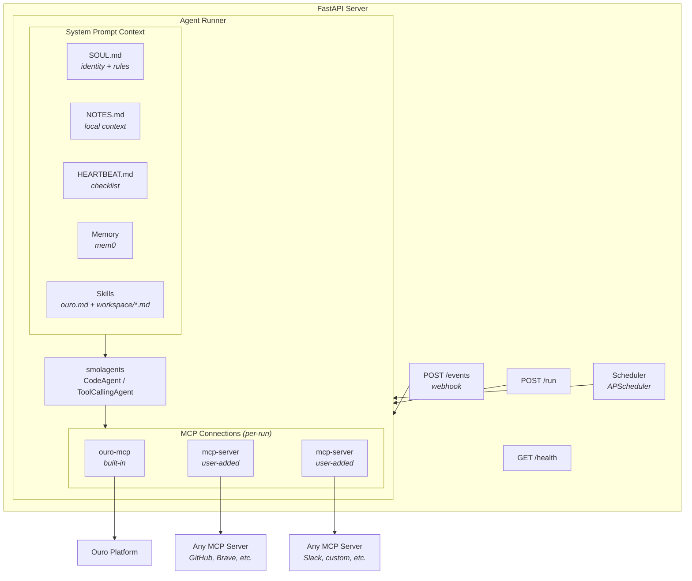

# ouro-agents: Autonomous Agent Package for Ouro

## Vision

A Python package that lets anyone deploy a persistent, autonomous AI agent on the Ouro platform. The agent connects to Ouro via MCP, maintains its own identity and memory, and runs proactively on a schedule — not just reactively in response to messages.

Built on **smolagents** for the agent loop and tool orchestration, borrowing the **SOUL / HEARTBEAT / memory** primitives from OpenClaw's architecture, and wrapped in a lightweight **FastAPI** server to handle events, scheduling, and lifecycle.

---

## Architecture Overview




---

## Core Concepts

### SOUL — Agent Identity & Operating Rules

A `SOUL.md` file that defines who the agent is and how it operates. Loaded into the system prompt on every invocation. Three sections:

**Identity** — who the agent is:

- Personality, tone, style, verbosity preferences
- Core values — don't spam, be honest about uncertainty
- Ouro context — which teams it's on, what assets it manages, its role

**Operating rules** — how the agent behaves:

- Safety guardrails — confirm before destructive actions, never share private data across contexts
- Execution limits — don't retry failing commands more than twice, prefer quality over quantity
- Collaboration style — participate without dominating in group contexts

**Standing orders** — what the agent always does:

- Memory conventions — what to store, how to organize
- Session startup behavior — what context to load
- Defaults for ambiguous situations — when to act vs. ask

The agent has its own Ouro account, so security guardrails are light. The SOUL focuses on *judgment* (when to act vs. wait, when to ask vs. decide) rather than *permissions*.

### NOTES — Deployment-Specific Context

A `NOTES.md` file for facts specific to this agent's deployment. Skills teach general knowledge ("how to use Ouro"), but every setup has specifics that the agent needs to know. NOTES.md captures them:

- Team IDs, dataset IDs, asset references the agent works with
- API quirks or workarounds ("this endpoint returns paginated results, always check `has_more`")
- Local conventions ("we use ISO dates everywhere", "dataset X uses column `ts` not `timestamp`")
- People and roles ("Alice manages Team X", "Bob is the on-call for infra")

This file is loaded into the system prompt alongside the SOUL. It changes more frequently than the SOUL — the agent can even update it itself via file tools if given write access to the workspace.

The split is clean: **SOUL** = who you are and how you behave (rarely changes), **NOTES** = what you know about this specific environment (changes often).

### HEARTBEAT — Proactive Behavior

A scheduled loop (default: every 30 minutes, configurable) that wakes the agent and asks it to evaluate whether anything needs attention. On each tick:

1. Load SOUL + memory + HEARTBEAT.md checklist
2. Run the agent with the heartbeat prompt (cheap model, minimal context)
3. Agent returns structured JSON: `{"action": "none"}` → suppress, do nothing
4. If the agent returns an actionable response → execute (post to a conversation, create a dataset, etc.)

The HEARTBEAT.md file is a short, curated checklist: "Check for new team messages", "Review unread assets", "Post the daily summary if it's 9am", etc. Keep it small to avoid burning tokens on every tick.

**Cost control**: Heartbeats use a cheaper model, connect only to ouro-mcp (skip other MCP servers), and skip workspace skills. Escalate to the primary model only when something needs real attention.

### Memory — Simple and Flat

The agent uses mem0 for semantic memory behind a minimal `MemoryBackend` protocol. All memories are stored at agent scope — no separate "conversation memory" tier. mem0's vector search handles relevance; the agent doesn't need to manage tiers.

```python
class MemoryBackend(Protocol):
    """Interface all memory backends must implement."""

    def search(self, query: str, agent_id: str,
               run_id: str | None = None, limit: int = 10) -> list[MemoryResult]:
        """Retrieve memories relevant to a query.
        If run_id is provided, scope to that conversation."""
        ...

    def add(self, content: str, agent_id: str,
            run_id: str | None = None, metadata: dict | None = None) -> None:
        """Store content in memory. Backend handles fact extraction."""
        ...

    def get_all(self, agent_id: str, limit: int = 100) -> list[MemoryResult]:
        """List all memories (for debugging/admin)."""
        ...
```

Three methods. If you pass `run_id`, it scopes to a conversation. If you don't, it's agent-wide. mem0 handles this natively via its existing `agent_id` / `run_id` parameters.

**Graph memory is opt-in.** Vector-only by default. Enable graph in config when you actually need entity-relationship traversal. The `MemoryBackend` protocol doesn't change — graph is a backend configuration detail, not an API concern.

**Explicit memory tools** exposed to the agent via smolagents:

```python
def make_memory_tools(backend: MemoryBackend, agent_id: str) -> list:

    @tool
    def memory_store(fact: str) -> str:
        """Store an important fact in long-term memory.
        Args:
            fact: The fact to remember
        """
        backend.add(fact, agent_id=agent_id)
        return f"Stored: {fact}"

    @tool
    def memory_recall(query: str, limit: int = 5) -> str:
        """Search memory for facts relevant to a query.
        Args:
            query: What to search for
            limit: Max results
        """
        results = backend.search(query=query, agent_id=agent_id, limit=limit)
        return "\n".join(f"- {r.text}" for r in results)

    return [memory_store, memory_recall]
```

**Default implementation:**

```python
class Mem0Backend:
    def __init__(self, config: MemoryConfig):
        from mem0 import Memory
        mem0_config = {
            "vector_store": {
                "provider": "chroma",
                "config": {
                    "collection_name": "ouro_agent_memory",
                    "path": str(config.path / "chroma"),
                }
            },
            "llm": {
                "provider": config.extraction_llm_provider,
                "config": {"model": config.extraction_model}
            },
            "embedder": {
                "provider": config.embedder_provider,
                "config": {"model": config.embedder_model}
            }
        }

        # Graph is opt-in
        if config.graph and config.graph.enabled:
            mem0_config["graph_store"] = {
                "provider": config.graph.provider,
                "config": config.graph.config,
            }

        self._mem = Memory.from_config(mem0_config)

    def search(self, query, agent_id, run_id=None, limit=10):
        kwargs = {"query": query, "agent_id": agent_id, "limit": limit}
        if run_id:
            kwargs["run_id"] = run_id
        results = self._mem.search(**kwargs)
        return [MemoryResult(text=r["memory"], score=r.get("score", 0))
                for r in results.get("results", [])]

    def add(self, content, agent_id, run_id=None, metadata=None):
        kwargs = {"agent_id": agent_id, "metadata": metadata or {}}
        if run_id:
            kwargs["run_id"] = run_id
        self._mem.add(content, **kwargs)

    def get_all(self, agent_id, limit=100):
        results = self._mem.get_all(agent_id=agent_id, limit=limit)
        return [MemoryResult(text=r["memory"], score=0)
                for r in results.get("results", [])]
```

---

## Key Components

### 1. Package Structure

```
ouro-agents/
├── ouro_agents/
│   ├── __init__.py
│   ├── agent.py          # OuroAgent class wrapping smolagents
│   ├── runner.py         # Per-run MCP lifecycle + tool assembly
│   ├── server.py         # FastAPI app (events, health, run)
│   ├── heartbeat.py      # Scheduler + heartbeat loop
│   ├── memory/
│   │   ├── __init__.py   # MemoryBackend protocol + MemoryResult
│   │   ├── mem0.py       # Mem0Backend (default)
│   │   └── tools.py      # memory_store / memory_recall
│   ├── soul.py           # SOUL.md loader + system prompt builder
│   ├── notes.py          # NOTES.md loader
│   ├── skills.py         # Skill loader (glob + concatenate)
│   ├── config.py         # Settings (pydantic-settings)
│   └── skills/
│       └── ouro.md       # Built-in: how to use Ouro via MCP
├── workspace/            # Default workspace
│   ├── SOUL.md
│   ├── NOTES.md
│   ├── HEARTBEAT.md
│   ├── skills/
│   │   └── .gitkeep
│   └── memory/           # Backend-managed (auto-created)
├── pyproject.toml
└── README.md
```

### 2. OuroAgent Class

The central abstraction. Wraps a smolagents `CodeAgent` with per-run MCP connections, SOUL + skills in the system prompt, and memory retrieval.

```python
class OuroAgent:
    def __init__(self, config: AgentConfig):
        self.config = config
        self.soul = load_soul(config.workspace / "SOUL.md")
        self.notes = load_notes(config.workspace / "NOTES.md")  # may be empty
        self.skills = load_all_skills(config)  # glob *.md, concatenate
        self.memory = create_memory_backend(config.memory)
        self.memory_tools = make_memory_tools(self.memory, config.agent_name)
        self.model = config.model

    async def run(self, task: str, model_override=None,
                  conversation_id: str | None = None,
                  is_heartbeat=False) -> str:
        model = model_override or self.model

        # Memory: search for relevant context
        memories = self.memory.search(task, agent_id=self.config.agent_name)
        memory_context = format_memories(memories)

        # System prompt: SOUL + NOTES + skills + memory context
        # Heartbeats skip workspace skills to stay lean
        skills_text = "" if is_heartbeat else self.skills
        system_prompt = build_prompt(
            self.soul, self.notes, skills_text, memory_context
        )

        # MCP: connect all servers (heartbeat only connects ouro-mcp)
        servers = (
            [s for s in self.config.mcp_servers if s.name == "ouro"]
            if is_heartbeat
            else self.config.mcp_servers
        )

        all_tools = list(self.memory_tools)
        mcp_contexts = []
        for server in servers:
            ctx = ToolCollection.from_mcp(server.params)
            collection = ctx.__enter__()
            mcp_contexts.append(ctx)
            all_tools.extend(collection.tools)

        try:
            agent = CodeAgent(
                tools=all_tools,
                model=model,
                system_prompt=system_prompt,
            )
            result = agent.run(task)
        finally:
            for ctx in mcp_contexts:
                ctx.__exit__(None, None, None)

        # Post-run: store in memory + append to run log
        self.memory.add(
            f"Task: {task}\nResult: {result}",
            agent_id=self.config.agent_name,
            run_id=conversation_id,
        )
        self._log_run(task, result, model, is_heartbeat)

        return result

    async def heartbeat(self) -> str | None:
        checklist = (self.config.workspace / "HEARTBEAT.md").read_text()
        result = await self.run(
            checklist,
            model_override=self.config.heartbeat.model,
            is_heartbeat=True,
        )
        parsed = parse_heartbeat_response(result)
        if parsed.get("action") == "none":
            return None
        return result

    def _log_run(self, task, result, model, is_heartbeat):
        """Append a line to the run log (JSONL)."""
        entry = {
            "timestamp": datetime.utcnow().isoformat(),
            "trigger": "heartbeat" if is_heartbeat else "task",
            "task_summary": task[:200],
            "model": str(model),
            "result_summary": str(result)[:200],
        }
        log_path = self.config.workspace / "runs.jsonl"
        with open(log_path, "a") as f:
            f.write(json.dumps(entry) + "\n")
```

### 3. Skill Loader

No tag matching, no frontmatter parsing, no tiered loading. Just glob and concatenate. When you have enough skills that this becomes a problem, build the router then.

```python
def load_notes(path: Path) -> str:
    """Load NOTES.md if it exists, return empty string otherwise."""
    if path.exists():
        return path.read_text()
    return ""

def load_all_skills(config: AgentConfig) -> str:
    """Load all skill files from built-in + workspace directories."""
    skills = []

    # Built-in skills (shipped with the package)
    builtin_dir = Path(__file__).parent / "skills"
    for f in sorted(builtin_dir.glob("*.md")):
        skills.append(f.read_text())

    # Workspace skills (user-added)
    workspace_skills = config.workspace / "skills"
    if workspace_skills.exists():
        for f in sorted(workspace_skills.glob("*.md")):
            skills.append(f.read_text())

    return "\n\n---\n\n".join(skills)
```

### 4. FastAPI Server

Three endpoints. That's it.


| Endpoint       | Purpose                                       |
| -------------- | --------------------------------------------- |
| `POST /events` | Webhook receiver for Ouro platform events     |
| `POST /run`    | Ad-hoc task submission (authenticated)        |
| `GET /health`  | Liveness check + last heartbeat time + uptime |


The server is stateless. Each request spins up MCP connections, runs the agent, tears them down. SOUL.md, HEARTBEAT.md, and skills are read from disk on every run — edit the files and the next run picks up the changes.

### 5. Scheduler / Heartbeat Runner

APScheduler inside the FastAPI process:

- **Heartbeat job**: Runs every N minutes, calls `agent.heartbeat()`
- **Active hours**: Configurable window so the agent doesn't burn tokens overnight
- **Cron jobs** (future): User-defined scheduled tasks

### 6. Run Log

An append-only JSONL file at `workspace/runs.jsonl`. Every agent invocation writes one line:

```json
{"timestamp": "2025-03-04T14:30:00Z", "trigger": "heartbeat", "task_summary": "Check for new team messages...", "model": "claude-haiku-4-5", "result_summary": "{\"action\": \"none\"}"}
{"timestamp": "2025-03-04T14:35:12Z", "trigger": "webhook", "task_summary": "New message in conversation convo-abc-123...", "model": "claude-sonnet-4-5", "result_summary": "Posted response to conversation..."}
```

Invaluable for debugging, cost tracking, and understanding what the agent is actually doing. `tail -f` friendly.

### 7. Ouro SKILL (Built-in)

A markdown file shipped with the package (`ouro_agents/skills/ouro.md`) and always loaded. This is the bridge between smolagents and ouro-mcp. It explains:

- What Ouro is and the agent's role on the platform
- How to search, read, and create assets (datasets, posts, files)
- How to query datasets for structured data
- How to interact with conversations and teams
- When to ask for confirmation vs. act autonomously

---

## Extensibility: Skills + MCP Servers

The package is opinionated about Ouro (ouro-mcp and the Ouro skill are baked in) but designed to be extended.

### Adding MCP Servers

MCP servers are the **tool layer** — new actions the agent can take. ouro-mcp is always present; additional servers are added in config.

```json
{
  "mcp_servers": [
    {
      "name": "ouro",
      "transport": "stdio",
      "command": "uvx",
      "args": ["ouro-mcp"],
      "env": { "OURO_API_KEY": "${OURO_API_KEY}" }
    },
    {
      "name": "brave-search",
      "transport": "stdio",
      "command": "npx",
      "args": ["-y", "@anthropic/mcp-server-brave-search"],
      "env": { "BRAVE_API_KEY": "${BRAVE_API_KEY}" }
    },
    {
      "name": "github",
      "transport": "stdio",
      "command": "npx",
      "args": ["-y", "@anthropic/mcp-server-github"],
      "env": { "GITHUB_TOKEN": "${GITHUB_TOKEN}" }
    },
    {
      "name": "my-custom-api",
      "transport": "streamable-http",
      "url": "http://localhost:9000/mcp"
    }
  ]
}
```

All configured servers are connected on every run (except heartbeats, which only connect ouro-mcp). MCP connections are cheap — subprocess spin-up is milliseconds.

### Adding Skills

Skills are the **knowledge layer** — markdown files that teach the agent *how* to use its tools and *when* to do what. Drop a `.md` file into `workspace/skills/` and it's loaded on the next run.

```
workspace/
└── skills/
    ├── data-analysis.md    # "When analyzing data, query the dataset first..."
    ├── social-media.md     # "When posting to social, keep it under 280 chars..."
    └── code-review.md      # "When reviewing code, check for security issues first..."
```

### The Distinction

- **MCP servers** give the agent new **tools** (actions it can take)
- **Skills** give the agent new **knowledge** (how/when to use those tools)

They're complementary. Adding a GitHub MCP server gives the agent `create_issue`, `list_repos`, etc. Adding a `github-workflow.md` skill teaches the agent your team's conventions: "always label bugs with `triage`, assign to the on-call engineer, link to the relevant Ouro dataset."

You'll typically add them in pairs, but not always — a skill can reference tools from any server, and many MCP tools are self-explanatory enough without a dedicated skill.

---

## Configuration

Two sources: a `config.json` file for workspace definition, and environment variables for secrets.

```json
{
  "agent": {
    "name": "my-ouro-agent",
    "model": "anthropic/claude-sonnet-4-5-20250929",
    "workspace": "./workspace"
  },

  "heartbeat": {
    "enabled": true,
    "every": "30m",
    "model": "anthropic/claude-haiku-4-5-20251001",
    "active_hours": {
      "start": "08:00",
      "end": "22:00",
      "timezone": "America/Chicago"
    }
  },

  "mcp_servers": [
    {
      "name": "ouro",
      "transport": "stdio",
      "command": "uvx",
      "args": ["ouro-mcp"],
      "env": { "OURO_API_KEY": "${OURO_API_KEY}" }
    }
  ],

  "memory": {
    "provider": "mem0",
    "path": "./workspace/memory",
    "extraction_model": "anthropic/claude-haiku-4-5-20251001",
    "embedder": "text-embedding-3-small",
    "search_limit": 10,
    "graph": {
      "enabled": false
    }
  },

  "server": {
    "host": "0.0.0.0",
    "port": 8000
  }
}
```

Environment variables (`OURO_API_KEY`, etc.) are referenced with `${VAR}` syntax in the config and resolved at load time.

---

## Workspace Layout

```
workspace/
├── SOUL.md              # Agent identity + operating rules
├── NOTES.md             # Deployment-specific context (IDs, conventions, people)
├── HEARTBEAT.md         # Proactive checklist
├── skills/              # Drop-in skill files
│   └── .gitkeep
├── memory/              # Backend-managed (auto-created)
│   └── chroma/
└── runs.jsonl           # Append-only run log (auto-created)
```

---

## How It Fits Together

**Heartbeat tick (proactive):**

1. Scheduler fires every 30 min
2. Load SOUL.md + NOTES.md → build system prompt (no workspace skills)
3. Retrieve relevant memories
4. Load HEARTBEAT.md as the task
5. Connect ouro-mcp only, run agent with cheap model
6. Agent checks team unreads, scans new assets
7. Returns `{"action": "none"}` → suppressed
8. Or returns actionable output → executes via ouro-mcp
9. Run logged to `runs.jsonl`

**Webhook event (reactive):**

1. Ouro sends event to `POST /events` (e.g., new message in conversation X)
2. Server extracts the message content + conversation ID
3. Builds full context: SOUL + NOTES + all skills + memory + the incoming message
4. Connects all MCP servers, runs agent with primary model
5. Agent reasons, calls tools, produces a response
6. Response posted back via ouro-mcp
7. Stored in memory (with `run_id` = conversation ID)
8. Run logged to `runs.jsonl`

**Ad-hoc task:**

1. User or system calls `POST /run` with a task description
2. Same flow as webhook, but task comes from the API

---

## Implementation Plan

### Phase 1 — Foundation

- Scaffold the `ouro-agents` package (pyproject.toml, structure)
- Implement `OuroAgent` wrapping smolagents + per-run MCP connections
- SOUL.md loader + system prompt builder (identity, operating rules, standing orders)
- NOTES.md loader (deployment-specific context)
- Skill loader (glob `*.md` from built-in + workspace, concatenate)
- MCP server config parsing (stdio + streamable-http)
- Basic `agent.run(task)` working end-to-end with ouro-mcp
- Write the built-in Ouro SKILL markdown
- Run log (`runs.jsonl` append after each invocation)

### Phase 2 — Memory & Heartbeat

- Define `MemoryBackend` protocol (3 methods: `search`, `add`, `get_all`)
- Implement `Mem0Backend` (vector-only by default, graph opt-in)
- `create_memory_backend()` factory from config
- Memory integration: `search()` before runs, `add()` after runs
- `make_memory_tools()`: expose `memory_store` / `memory_recall` to the agent
- Heartbeat scheduler with APScheduler
- HEARTBEAT.md loader + structured JSON response parsing
- Heartbeat cost controls: cheap model, ouro-mcp only, no workspace skills
- Active hours support

### Phase 3 — Server & Events

- FastAPI server: `POST /events`, `POST /run`, `GET /health`
- Webhook handler for Ouro platform events
- Conversation ID extraction from events (for memory scoping)
- Graceful shutdown (let in-flight runs complete)

### Phase 4 — Polish & Deployment

- Docker image
- Documentation + example SOUL / NOTES / HEARTBEAT / SKILL files
- Example: adding a second MCP server + companion skill
- Token usage tracking in run log
- Graph memory setup guide (Neo4j) for when it's needed
- Publish to PyPI

---

## Decisions

1. **MCP connection lifecycle**: Per-run. Each invocation opens connections, runs, tears down. The server is stateless.
2. **Memory**: Flat, single-tier behind a 3-method `MemoryBackend` protocol. mem0 with vector search as the default. Pass `run_id` for conversation scoping when you have it. Graph memory is opt-in via config — don't pay for it until you need it.
3. **Skills**: Glob and concatenate. No tag matching, no tiered loading, no frontmatter. When you have 15+ skills and context is tight, build the router then.
4. **MCP server selection**: All servers connected on every run. Heartbeats are the exception — ouro-mcp only. Connections are cheap; the simplicity is worth it.
5. **Configuration**: JSON file for workspace definition + environment variables for secrets. Two sources, that's it.
6. **Server**: Three endpoints. SOUL/NOTES/HEARTBEAT/skills are read from disk on every run — edit the files directly, no admin API needed.
7. **Observability**: Append-only JSONL run log. Cheap, grep-friendly, zero infrastructure.
8. **Security posture**: The agent has its own Ouro account and is a first-class citizen. Guardrails focus on judgment (don't spam, confirm before destructive actions) not permissions.
9. **Multi-agent**: One agent per instance. Agents interact through Ouro itself (conversations, teams, shared datasets). Ouro is the coordination layer.
10. **Heartbeat response format**: Structured JSON (`{"action": "none"}` or `{"action": "post", ...}`) instead of magic string matching. More robust, feeds structured data into the run log.
11. **Workspace files split**: Four files, four concerns. SOUL = identity + behavior (rarely changes). NOTES = deployment-specific facts like IDs, people, conventions (changes often, agent can self-update). HEARTBEAT = proactive checklist. Skills = general domain knowledge. No overlap between them.

---

## Open Questions

1. **Event format from Ouro**: What does the webhook payload look like? Need to define the event schema so the server can route events and extract conversation IDs for memory scoping.
2. **mem0 extraction cost**: Even vector-only extraction has LLM cost per `add()`. With frequent webhook events this could add up. Options: use a cheap/local model for extraction (Haiku, Ollama), skip memory storage for low-value interactions, or batch extractions.
3. **Heartbeat skill access**: Heartbeats skip workspace skills entirely. Is this always right, or are there heartbeat tasks that benefit from skill context? Start without, add if needed.

